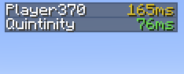

# Better Ping Display

 

A mod for Minecraft to display each player's ping in the player list as a number. There is also a config file for changing the text color and format.

This is a client-side mod. The server doesn't need to have it installed. It works even when playing on vanilla servers.

## Configuration
This mod's config file is `betterpingdisplay.cfg`. It contains the following options:

| Option            | Default Value  | Description  |
|-------------------|----------------|--------------|
| autoColorText     | `true`         | Whether to color a player's ping based on their latency. E.g, low latency = green, high latency = red |
| renderPingBars    | `false`        | Whether to also draw the default Minecraft ping bars  |
| textColor         | `#A0A0A0`      | The ping text color to use. Only works whens `autoColorText` is false |
| textFormatString  | `%dms`         | The format string for ping text. Must include a `%d`, which will be replaced dynamically by the actual ping value.

## Requirements
* [Minecraft Forge](https://files.minecraftforge.net/net/minecraftforge/forge/index_1.7.10.html)
